# test-repo
## Цель лабораторной работы: 
Изучение базовых возможностей системы управления версиями, опыт работы с Git Api, опыт работы с локальным и удаленным репозиторием.

## Выполнение задания:
Командой git clone скопирован основной репозиторий.
Команда cd позволяет перейти в необходимую папку.
Git status отображает изменения в репозитории.
Git branch – отображает все ветки, которые есть в репозитории.
Командой git config --global user.name "4441b Odintsova I.D." задано имя пользователя,
git config --global user.email shhheepy@gmail.com – задает электронный адрес пользователя.
На сайте github создан репозиторий test-repo, командой git clone скопирован личный удаленный репозиторий.
В интерфейсе github создан файл fail-task6.
Команда git pull origin main подтягивает изменения.
Dir – отображает содержимое (рис. 1).

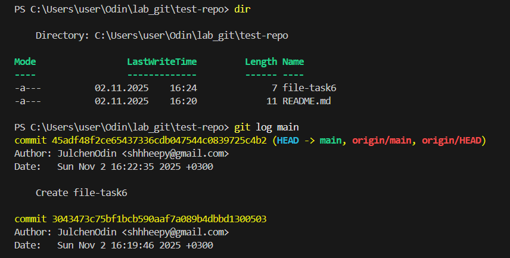

## Посмотреть историю изменений:
Команда git log main отобразила коммиты,
git reflog - отобразила все изменения в главной ветке (рис. 2).
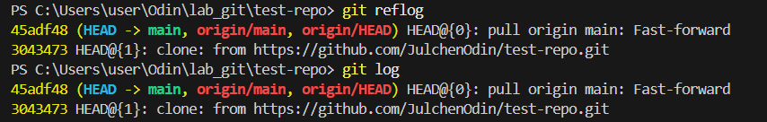

git diff – изменения по файлам, git diff HEAD~1 HEAD – отображает разницу между двумя последними коммитами (рис. 3). 
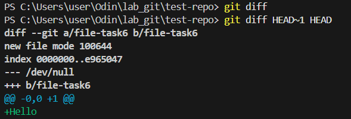

## Создан конфликт:
Команда git checkout -b odintsova-patch-conflict создала новую ветку. При создании, мы переключиились на новую ветку, для возвращения на старую использована команда git checkout main.
Создан файл 9.txt (рис. 4) 

Создан коммит с новым добавленным файлом (рис. 6):
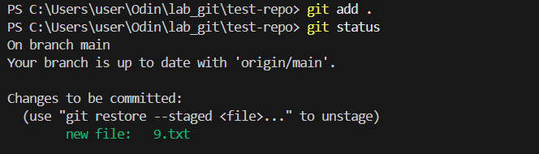
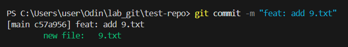
В ветке odintsova-patch-conflict создана ветка. Видно, что в ней нет файла 9.txt (рис. 7).
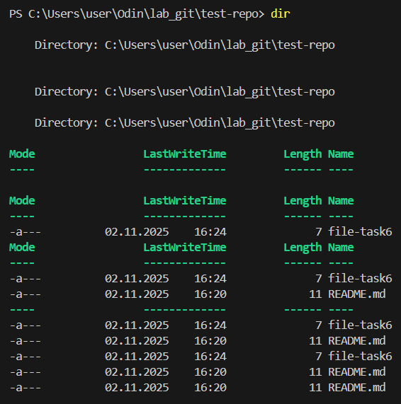

Для создания конфликта, создана еще она версия файла 9.txt.
Снова создан коммит (рис. 8). 
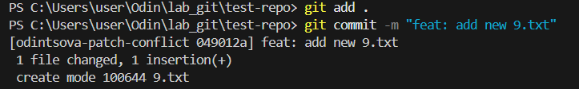

Создано ответвление (рис. 9): 
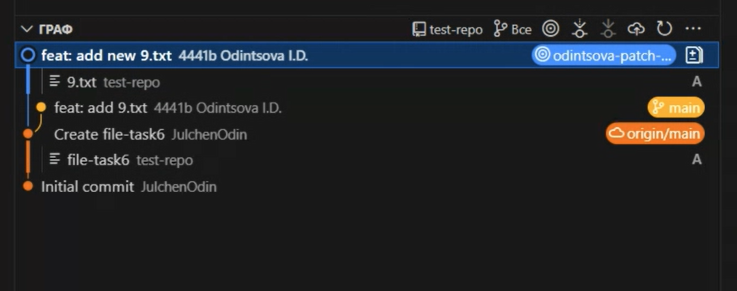

Переход в ветку main, использование команды git merge должно объединить историю изменений и создать коммит, содержащий изменения обеих веток, здесь виден созданный конфликт (рис. 10, 11): 
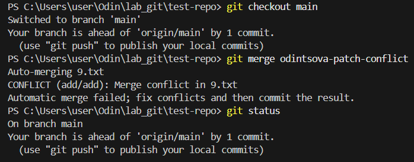
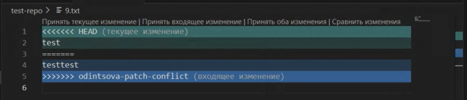

Конфликт разрешен, сделан коммит, ветки слились (рис. 12): 
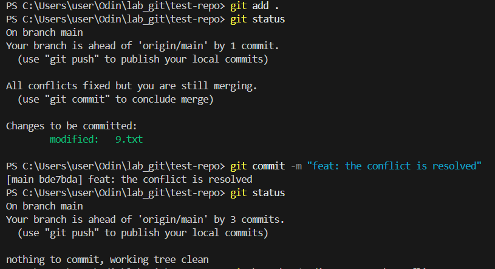

Удаление побочной ветки после слияния командой git branch -d odintsova-patch-conflict (рис. 13): 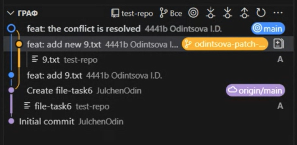

Создан файл 11.txt, делано два коммита с изменениями в нем (рис. 14):
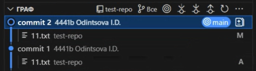

Сделан откат коммита командой git revert HEAD (рис. 15):
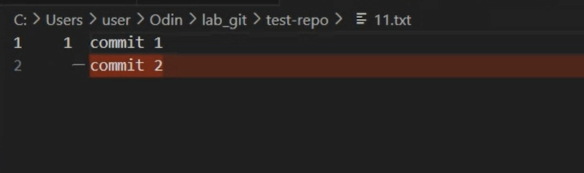

Создана ветка для отчета командой git checkout -b odintsova-patch-report
Получена история операция с помощью git log --pretty=format:"%h | %ad | %an | %s" --date=short > commit-history.txt (рис. 16). 
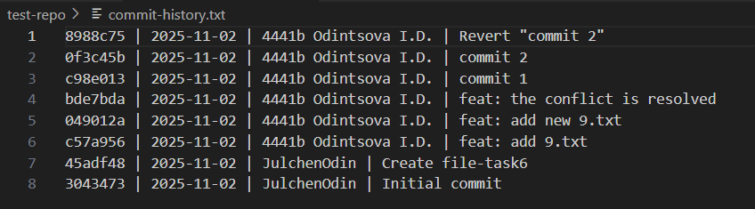

Загружена ветка main командой git push origin main.

## Вывод:
При выполнении работы я изучила возможности системы управления версиями, получила опыт работы с Git Api, с локальным и удаленным репозиториями.